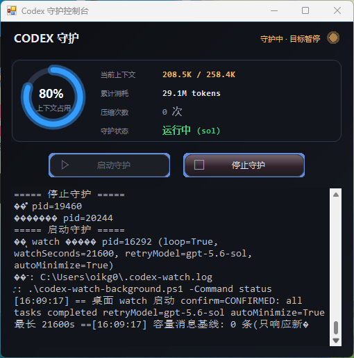
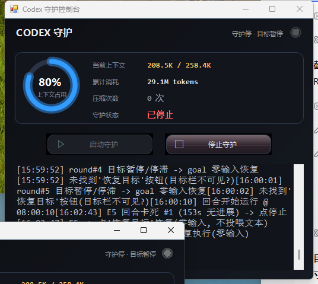

# Codex 守护 — 让 Codex 桌面端永不停机

针对 **Codex / ChatGPT 桌面端** 的自包含桌面守护程序。当模型报
`Selected model is at capacity`、目标自动暂停或回合卡死时,**Codex 守护一键点击"恢复目标"**,
零新增输入 token, 不烧上下文。

 
*左: 守护中 · 运行中(绿)。右: 守护停(灰)。*

## 功能

- **目标自动恢复** — 检测桌面端目标暂停/停滞, 自动点击"恢复目标"(零输入 token)。模型锁定 `gpt-5.6-sol`。
- **自动点击恢复** — 目标暂停/容量错误时自动点"恢复目标", 回合卡死自动"停止+恢复目标"(60 秒防重冷却); 托盘提醒保留, 让你知情。
- **11 类异常检测 + 托盘提醒** — 容量错误、目标暂停、守护停止、桌面未运行、回合卡死、上下文 >85%、bridge 离线、模型被切离 sol、token 消耗突增、频繁压缩、会话磁盘膨胀。
- **实时 token 监控** — 动画环形仪表 + 统计: 当前上下文占用 / 窗口上限 / 累计消耗 / 压缩次数 / 守护状态(每 3 秒从会话 JSONL 轮询)。
- **实时工作状态**(右上角, 基于 UI Automation): `守护中 · 运行中`、`目标暂停`、`容量错误`、`空闲`、`桌面未运行`。
- **四道投喂闸门** — 冷却、内容去重、每小时次数上限、上下文预算门禁(读取失败即拦截), 自动值守绝不乱花 token、不撑爆上下文。
- **防重复启动** — 守护运行中"启动守护"自动置灰, 只剩"停止守护"可点。
- **高颜值界面** — 暗色渐变主题、呼吸状态灯、玻璃光泽渐变按钮(蓝流光 / 红上升填充)、点击波纹、DPI 感知(PerMonitorV2), 所有内容随窗口等比缩放。
- **单文件自包含 EXE** — 全部脚本以 Base64 内嵌进桌面 EXE, 除 PowerShell 7 外无任何外部依赖。

## 环境要求

- Windows 10/11
- [PowerShell 7+](https://github.com/PowerShell/PowerShell)(`pwsh` 在 PATH)
- 正在运行的 Codex / ChatGPT 桌面端(被守护的对象)

## 快速开始(推荐)

1. 从 [Releases](../../releases) 下载 `CodexGuard.exe`, 放到桌面。
2. 双击运行, 守护每 3 秒自动轮询桌面端。
3. 点 **启动守护** — 按钮置灰, 右上角状态变绿 `守护中 · 运行中`。
4. 最小化窗口即可挂机(动作时自动弹回再最小化)。
5. 点 **停止守护** 结束。

> EXE 内嵌全部脚本, 首次运行如发现缺失会自动释放到 `%USERPROFILE%`。

## 源码构建

```powershell
# 1) 把 src/ 下的 5 个脚本 + build-exe.ps1 放到 %USERPROFILE%
# 2) 构建桌面 EXE
.\build-exe.ps1
# -> 生成 Desktop\CodexGuard.exe(内嵌全部脚本)
```

## 脚本说明

| 脚本 | 用途 |
|---|---|
| `src/codex-desktop-drive.ps1` | UIA 驱动: `status` / `send` / `model` / `goal` / `watch`(守护主循环) |
| `src/codex-watch-background.ps1` | 后台启动器: `start` / `stop` / `status` / `logs`, 支持循环模式 |
| `src/codex-desktop-feeder.ps1` | 无头喂料: 走本地 app-server(与桌面端同引擎、共享会话) |
| `src/codex-relay-switch.ps1` | 上游 relay 健康探针 + 切换(带自动回滚), 从源头解决 `at capacity` |
| `src/codex-session-health.ps1` | 长会话降智体检: `scan` / `signals` / `mitigate`(压缩或新线程重开) |
| `build-exe.ps1` | 构建自包含桌面 EXE(脚本以 Base64 内嵌) |

## 守护循环原理

```
容量错误 / 目标暂停 / 回合卡死
        -> 退避(30s..300s 指数, 仅 sol, 不切模型)
        -> 点击"恢复目标"(零输入 token)
        -> 目标在 gpt-5.6-sol 上继续执行
文本"继续"是绝对最后手段, 仅在:
  没有目标 且 四道闸全部放行(冷却 / 去重 / 频率上限 / 上下文预算)
```

## 许可

MIT
